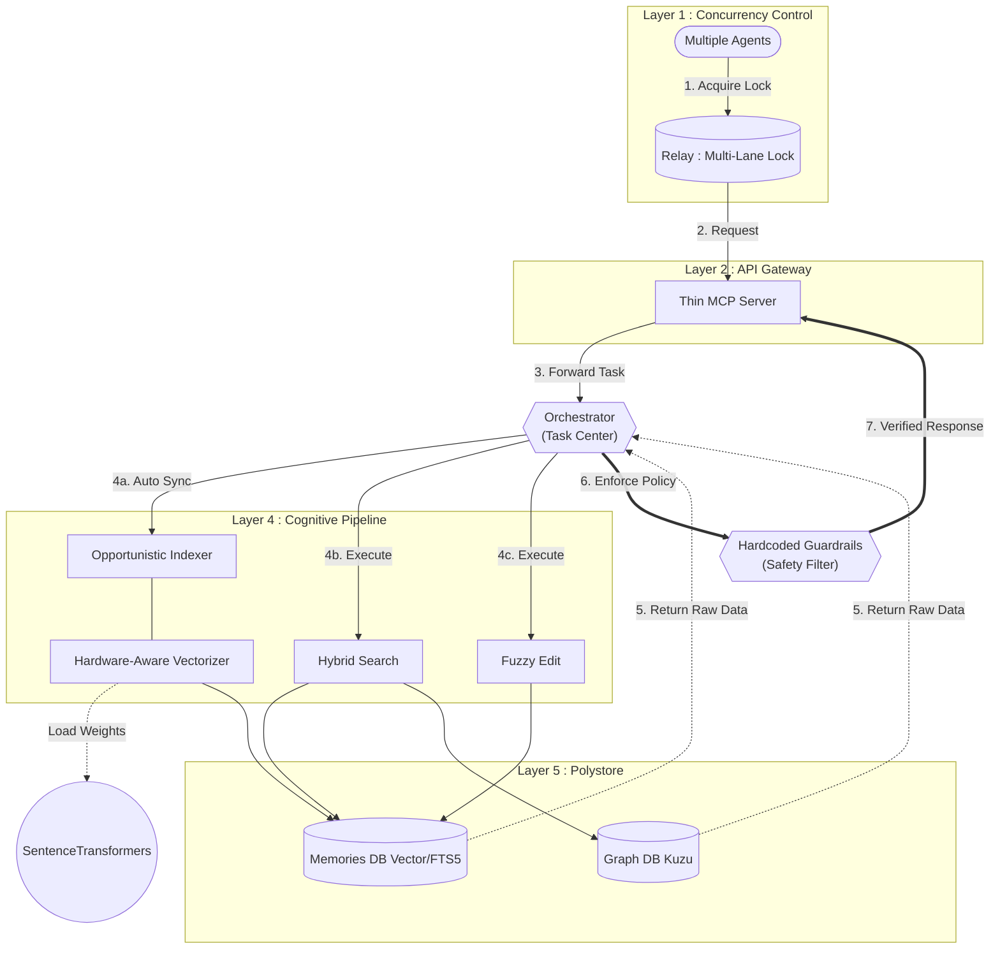

[Korean Version Available](README.md)

# 🌌 Cortex Agent Infrastructure (`.agents`)

**"The Bridge between Human Intent and Agent Intelligence."**

A **Universal Agent Engineering Infrastructure** designed to persist fragmented agent memories and establish immediate task context for any project via the Model Context Protocol (MCP). This project combines modern multi-agent orchestration patterns with hybrid database technologies to provide a robust context engine.

Since the **v2.1.0 release**, it has evolved into a zero-overhead **Hardware-Aware Hybrid Engine** based on the "Inference Economy" philosophy.

---

## 🏗 System Architecture

The transition from a monolith (V1) to specialized modular components (V2) ensures maximum scalability and stability.



---

## 🚀 Key Features

### 1. Hybrid Context Engine (Vector + Graph + RDB)
*   **Vector Search (`sqlite-vec`)**: Runs 100% natively in the local environment without heavy external dependencies like FAISS, restoring semantic search in seconds.
*   **Graph Analysis (`Kuzu DB`)**: Tracks function calls, "contains" relationships, and external library references through Cypher queries to provide multi-dimensional context.
*   **FTS5 Text Search**: Supports high-speed broad keyword search and Reciprocal Rank Fusion (RRF) scoring.

### 2. Inference Economy & Hardware-Aware Strategy
*   **GPU_THRESHOLD Heuristic**: Forces CPU processing for small datasets (under 20 items) to save VRAM, and immediately calls `release_gpu()` upon completion to return resources.
*   **Intelligent Performance Throttling (`settings.yaml`)**: Automatically detects system specs on startup and dynamically manages cache cleanup cycles and batch sizes (Dynamic Downscaling) to prevent system crashes.
*   **Opportunistic Indexing**: Scans project `mtime` the moment an agent calls MCP to track only changed parts, ensuring zero-overhead synchronization hooks.

### 3. Multi-Lane Parallel Execution
Extends beyond a single global lock to support **Domain (Lane)-based Parallel Locking**. Multiple terminals can work simultaneously in assigned lanes (e.g., `frontend`, `backend`) with safe handoffs using `fcntl`-based exclusive locks.

### 4. Precision Editing (Hashline Style)
Uses content-based substitution to prevent code corruption caused by line-number mismatches. The editing engine includes fuzzy-matching logic to address common indentation or spacing errors typical of small LLMs (0.6B).

### 5. Lean Context Optimization & Guardrails
Blocks polluted file scans via `.geminiignore` and strictly forbids direct shell commands (e.g., `grep`, `find`). All navigation and editing must pass through controlled **Capsule Search** and the MCP pipeline to maximize token efficiency and operation stability.

---

## 🔬 Key Differentiators

Cortex focuses on extreme local optimization and inter-agent reliability, distinguishing it from generic RAG tools.

*   **Integrated Polystore (Hybrid RAG Fusion)**: 
    *   Unifies Vector (sqlite-vec), FTS5, and Graph (Kuzu) into a single Reciprocal Rank Fusion (RRF) scoring system.
    *   Tracks complex relationships between "Agent Skills" and "Code Nodes" beyond simple retrieval.
*   **Latency-First HW Optimization**:
    *   Dynamically switches between CPU and GPU based on computational load to minimize model loading and VRAM transfer overhead.
    *   Engineered for field use on consumer-grade hardware (e.g., 6GB VRAM laptops) with explicit resource recycling.
*   **Atomic Multi-Agent Concurrency (TOCTOU Defense)**:
    *   Kernel-level exclusive locks via `fcntl` prevent Time-Of-Check-Time-Of-Use (TOCTOU) race conditions.
    *   Validated through stress tests (1,000+ simultaneous requests) to ensure data integrity during parallel agent handoffs.
*   **Engineering-First Control Tower**:
    *   Serves as a "Relay Tower" for agents to self-critique and audit tasks, rather than just a simple IDE plugin.

---

## 📂 Directory Structure

```
.agents/
├── data/           # [Non-Shared] State & Hybrid DBs (Kuzu, sqlite-vec)
├── docs/           # [Non-Shared] Infra Documentation (Structure only)
├── history/        # [Non-Shared] Session history & Observation logs
├── hooks/          # Runtime lifecycle hooks (hooks_manager dispatcher)
├── rules/          # Agent behavior rules & Precision edit guidelines
├── scripts/        # Cortex core modules, MCP server, and Relay scripts
├── skills/         # [Non-Shared] Agent-specific skill guides
├── tasks/          # Task documents for proactive tracking (Todo Manager)
├── templates/      # System templates and ignore bundles
├── knowledge/      # External knowledge library
├── venv/           # [Non-Shared] Python virtual environment
├── .env            # [Non-Shared] Environment variables
└── settings.yaml   # Global infrastructure settings & tuning parameters
```

---

## 🛠 Installation & Usage

- **Detailed Guide**: [INSTALL.md](./INSTALL.md)
- **Key Commands**:
  - `/load`: Pull `.agents` from Google Drive to workspace.
  - `/backup`: Backup local `.agents` state to Google Drive (rclone-based).
  - `/knowledge`: Permanently save major decisions and success patterns.
  - `python3 .agents/scripts/relay.py status`: Check current Relay/Multi-Lane lock status.

---

## 🙌 Inspirations

Cortex was born by modularizing and integrating concepts from the following excellent projects:

- **Vexp ([https://vexp.dev/](https://vexp.dev/))**: Referenced for modular workflow structures and DB schema formats.
- **oh-my-agent ([first-fluke/oh-my-agent](https://github.com/first-fluke/oh-my-agent))**: Introduced the concept of portable agent definitions and role specialization.
- **oh-my-claudecode ([Yeachan-Heo/oh-my-claudecode](https://github.com/Yeachan-Heo/oh-my-claudecode))**: Adopted Deep Interview patterns and artifact-based handoffs.
- **oh-my-openagent ([code-yeongyu/oh-my-openagent](https://github.com/code-yeongyu/oh-my-openagent))**: Integrated Hashline-based precision editing and Sisyphus-style infinite verification loops.

---

## ⚖️ License
- **Code**: [MIT License](LICENSE)
- **Knowledge Base (vendor)**: The origin of the external knowledge library is [antigravity-awesome-skills](https://github.com/sickn33/antigravity-awesome-skills) and follows the [CC BY 4.0](https://creativecommons.org/licenses/by/4.0/) license.
