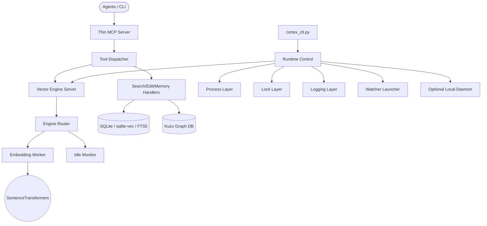

[Korean Version Available](README.md)

# Cortex Agent Infrastructure (`.cortex`)

**"The Bridge between Human Intent and Agent Intelligence."**

Cortex is a universal agent engineering infrastructure designed to persist fragmented agent memory and establish immediate task context for any project through MCP(Model Context Protocol). It combines local-first context indexing, hybrid search, graph analysis, and multi-agent coordination.

The current architecture uses `.cortex` as the default path model and separates the previous monolithic control surface into dispatcher, server, worker, watcher, and runtime control layers.

---

## System Architecture

The MCP server, tool dispatcher, vector engine server, embedding worker, watcher, and process control layers are separated. `cortex_ctl.py` remains a thin entrypoint; the actual start/status/stop orchestration lives under `scripts/cortex/runtime/`.



---

## Key Features

### 1. Hybrid Context Engine & AST Parsing

- **AST Structural Parsing (`Tree-sitter`)**: Extracts classes, functions, and call relationships from Python, C#, TypeScript, and related source files.
- **Vector Search (`sqlite-vec`)**: Provides local SQLite-backed vector search without an external vector server.
- **Graph Analysis (`Kuzu DB`)**: Tracks call, containment, and external reference relationships as a graph.
- **FTS5 Text Search**: Supports keyword search and Reciprocal Rank Fusion scoring.

### 2. Runtime Modularization

The runtime control layer is split as follows.

- `runtime/paths.py`: ports, scripts, log files, and lock files
- `runtime/ipc.py`: length-prefixed socket message transport
- `runtime/environment.py`: child process environment construction
- `runtime/process.py`: background process launch and PID handling
- `runtime/lock.py`: mutual exclusion for ctl operations
- `runtime/logging.py`: runtime logging setup
- `runtime/control.py`: start/status/stop orchestration
- `runtime/engine_server.py`: engine server entrypoint
- `runtime/engine_router.py`: worker routing and idle monitor integration
- `runtime/engine_worker.py`: PyTorch/SentenceTransformers embedding worker
- `runtime/worker_manager.py`: worker lifecycle and status handling
- `runtime/watcher_launcher.py`: watchdog watcher launcher
- `runtime/local_daemon.py`: optional local daemon launcher

This boundary keeps the Python implementation intact while making future CLI hook integration, partial Rust ports, and worker replacement more realistic.

### 3. `.cortex` Path Model

The default path is `.cortex`. Installation, documentation, and CI are aligned around `.cortex`.

- `CORTEX_HOME`: Cortex infrastructure root
- `CORTEX_WORKSPACE`: actual project root to index and edit
- `CORTEX_ENV_PATH`: explicit `.env` path when needed

### 4. Multi-Lane Parallel Execution

The relay layer supports lane-based coordination so multiple agents or terminals can work concurrently with reduced conflict.

### 5. Hardware-Aware Embedding Strategy

The SentenceTransformers/PyTorch embedding path is isolated inside a worker process. GPU/MPS/CUDA dependency stays in the Python worker, while the control/server/router layers remain less coupled to model runtime details.

---

## Directory Structure

```text
.cortex/
├── data/           # [Non-shared] state and hybrid DBs
├── docs/           # [Non-shared] infrastructure documentation
├── history/        # [Non-shared] session history and logs
├── hooks/          # runtime lifecycle hooks
├── rules/          # agent behavior rules and precision editing guidelines
├── scripts/        # Cortex core modules, MCP server, and runtime control layer
├── skills/         # [Non-shared] agent skill guides
├── tasks/          # task documents for proactive tracking
├── templates/      # system templates and ignore bundles
├── knowledge/      # external knowledge library
├── pyproject.toml  # uv dependency declaration
├── .venv/          # [Non-shared] uv-managed virtual environment
├── uv.lock         # package lockfile
├── .env            # [Non-shared] environment variables
└── settings.yaml   # global infrastructure settings
```

---

## Cortex Modular Layout

Following the recent architectural refactoring, the Cortex backend has been modularized by role. SQLite, GraphDB, search, embedding, and memory implementations live in the sub-packages:

- `cortex/indexing/`: Indexing pipelines (extractions, persistence, graph sync)
- `cortex/embeddings/`: Model loading, batch embeddings, and hardware detection
- `cortex/retrieval/`: Hybrid search algorithms (FTS, semantic, RRF merging)
- `cortex/storage/`: SQLite and GraphDB connection and schema management
- `cortex/memories/`: Working memory and persistent knowledge CRUD
- `cortex/config/`: YAML config loading and hardware-aware tuning
- `cortex/scanner/`: `.gitignore`-aware file scanning
- `cortex/parsers/`: Tree-sitter-based language parser registry
- `cortex/runtime/`: Execution infrastructure (daemon workers, locks, IPC)

> External Workspace path handling follows `runtime.paths` and the new `.cortex` path policy. Heavy dependencies like model downloads or GPU tokens are excluded from the base CI and are intended for separate local verification.

---

## Installation & Usage

See [INSTALL.md](./INSTALL.md) for the full guide.

Core commands:

```bash
uv sync --project .cortex
uv run --project .cortex python .cortex/scripts/cortex/indexer.py . --force
uv run --project .cortex python .cortex/scripts/cortex_ctl.py status
uv run --project .cortex python .cortex/scripts/cortex_ctl.py start
uv run --project .cortex python .cortex/scripts/cortex_ctl.py stop
```

For MCP registration, explicitly set `PYTHONPATH`, `CORTEX_HOME`, and `CORTEX_WORKSPACE`.

---

## CI Coverage

GitHub Actions verifies the following on Windows and Ubuntu:

- dependency sync through `uv sync`
- `py_compile` across all `scripts/**/*.py`
- runtime module import smoke checks
- `scripts/cortex/tests/test_*.py` regression tests
- `.cortex`-based test workspace indexing
- MCP JSON-RPC smoke test

Long-running daemon behavior, real GPU/CUDA memory behavior, and local model cache state remain local validation targets because they depend on the host environment.

---

## Inspirations

- **Vexp**: workflow structure and DB schema patterns
- **oh-my-agent**: role-based agent specialization and portable agent definitions
- **oh-my-claudecode**: deep-interview and artifact handoff patterns
- **oh-my-openagent**: hash-based precision editing and verification loop patterns

---

## License

- **Code**: [MIT License](LICENSE)
- **Knowledge Base**: The external knowledge library originates from [antigravity-awesome-skills](https://github.com/sickn33/antigravity-awesome-skills) and follows the [CC BY 4.0](https://creativecommons.org/licenses/by/4.0/) license.
