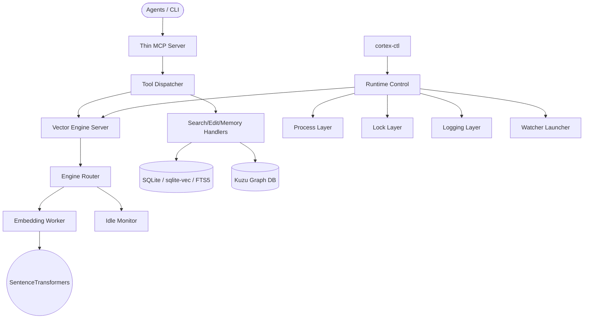

[Korean Version Available](README.md)

# Cortex Agent Infrastructure (`.cortex`)

**"The Bridge between Human Intent and Agent Intelligence."**

Cortex is a local-first agent infrastructure for persistent memory, semantic code search, graph analysis, and MCP integration. The current model installs Cortex once as a global tool and stores per-workspace data under `~/.cortex/workspaces/<key>/`, so user projects do not need to carry Cortex runtime files.

---

## System Architecture

The MCP server, tool dispatcher, vector engine server, embedding worker, watcher, and runtime control layers are separated. `cortex-ctl` owns start/status/stop orchestration, while the embedding model is isolated in a worker process.



---

## Key Features

### 1. Hybrid Context Engine

- **Tree-sitter parsing**: extracts classes, functions, and call relationships from Python, C#, TypeScript, and related source files.
- **Vector search**: uses `sqlite-vec` for local semantic search.
- **Graph analysis**: stores call and containment relationships in Kuzu.
- **FTS5 search**: combines keyword search with Reciprocal Rank Fusion scoring.

### 2. Runtime Modularization

The runtime is split into path resolution, IPC, process launch, locks, logging, control, engine routing, worker lifecycle, and watcher launch modules under `cortex/runtime/`. This keeps GPU/PyTorch dependencies inside the embedding worker and leaves control/server/router code relatively lightweight.

### 3. Global Data Model

- `CORTEX_HOME`: Cortex package/runtime root.
- `CORTEX_WORKSPACE`: project root to index and edit.
- `CORTEX_DATA_HOME`: global data root, default `~/.cortex`.
- `CORTEX_WORKSPACE_KEY`: optional shared key for grouping multiple folders into one Cortex workspace.
- `CORTEX_ENV_PATH`: explicit dotenv path.

Code indexes, memory DBs, graph stores, and session history live under `<CORTEX_DATA_HOME>/workspaces/<key>/`. The default key is derived from the workspace path; set `CORTEX_WORKSPACE_KEY` when multiple repositories should share one Cortex data directory.

---

## Directory Model

```text
.cortex/                                  # Cortex source/package root
├── hooks/                                # runtime lifecycle hooks
├── rules/                                # agent rules and editing policies
├── scripts/                              # Cortex modules, MCP server, runtime control
├── knowledge/
│   └── knowledge.zip                     # optional knowledge seed
├── pyproject.toml                        # uv dependency declaration
└── settings.yaml                         # infrastructure settings

~/.cortex/                                # CORTEX_DATA_HOME
├── .env                                  # optional global Cortex environment
└── workspaces/
    └── <workspace-key>/
        ├── memories.db
        ├── graph_db_store/
        └── history/
```

---

## Installation

See [INSTALL.en.md](./INSTALL.en.md) for the full installation guide.

```bash
# Install Cortex once as a uv tool.
uv tool install "git+https://github.com/kth3/Cortex-agents_infra.git"

# Install supported Codex/Claude hooks and initialize the data directory.
cortex-ctl bootstrap --include-all

# Optional: save a HuggingFace token and warm the embedding model cache.
cortex-ctl bootstrap --include-all --hf-token <YOUR_HF_TOKEN> --warm-models
```

Update:

```bash
uv tool upgrade cortex-agent
```

Development mode from a source checkout:

```bash
uv sync
uv run cortex-ctl bootstrap --include-all
uv run cortex-index --force
```

---

## `cortex-ctl` Surface

```text
cortex-ctl start | stop | restart | status
cortex-ctl bootstrap [--include-all] [--enable-knowledge]
                     [--hf-token <T>] [--warm-models]
                     [--embedding-model <id>] [--embedding-max-seq-length <n>]
                     [--dry-run]
cortex-ctl knowledge enable | disable | status [--force]
cortex-ctl migrate [--source <workspace>] [--dry-run] [--force]
```

---

## HuggingFace Token Policy

Cortex does not require `HF_TOKEN` for public models. Use one of these methods only when a gated model or faster authenticated access is needed:

| Method | Behavior |
|---|---|
| `cortex-ctl bootstrap --hf-token <T>` | Stores `HF_TOKEN=<T>` in `~/.cortex/.env`. |
| `HF_TOKEN=<T>` environment variable | Uses the shell-provided token. |
| `huggingface-cli login` | Uses the standard `~/.cache/huggingface/token` file. |

The implementation passes `token=None` when `HF_TOKEN` is unset or blank, so the HuggingFace library can still use its standard cached-token fallback.

---

## Embedding Model Policy

Default model:

```text
Qwen/Qwen3-Embedding-0.6B
max_seq_length = 4096
```

Override through bootstrap:

```bash
cortex-ctl bootstrap \
  --embedding-model google/embeddinggemma-300m \
  --embedding-max-seq-length 2048 \
  --warm-models
```

Or through environment variables:

```bash
export CORTEX_EMBEDDING_MODEL=google/embeddinggemma-300m
export CORTEX_EMBEDDING_MAX_SEQ_LENGTH=2048
```

`trust_remote_code` is disabled by default. The default Qwen embedding model requires it, so enable it explicitly after reviewing the model code:

```bash
export CORTEX_EMBEDDING_TRUST_REMOTE_CODE=true
```

Changing embedding model dimensions makes existing vectors incompatible. Run a full reindex after changing model family or vector dimension:

```bash
cortex-index --force
```

---

## MCP Registration

Codex and Claude Code hooks are installed through `cortex-ctl bootstrap`. MCP entrypoints remain available for platforms that support MCP directly:

```bash
cortex-mcp
cortex-index <workspace> --force
```

When registering MCP manually, pass `CORTEX_HOME`, `CORTEX_WORKSPACE`, and optionally `CORTEX_WORKSPACE_KEY` explicitly so the server resolves the same workspace data directory across platforms.

---

## CI Coverage

GitHub Actions verifies dependency sync, `py_compile`, runtime import smoke checks, unit regression tests, test workspace indexing, and MCP JSON-RPC smoke tests on Windows and Ubuntu. Long-running daemon behavior, real GPU/CUDA memory behavior, and local model cache state remain local validation targets.

---

## License

- **Code**: [MIT License](LICENSE)
- **Knowledge**: The external knowledge seed originates from [antigravity-awesome-skills](https://github.com/sickn33/antigravity-awesome-skills) and follows the [CC BY 4.0](https://creativecommons.org/licenses/by/4.0/) license.
