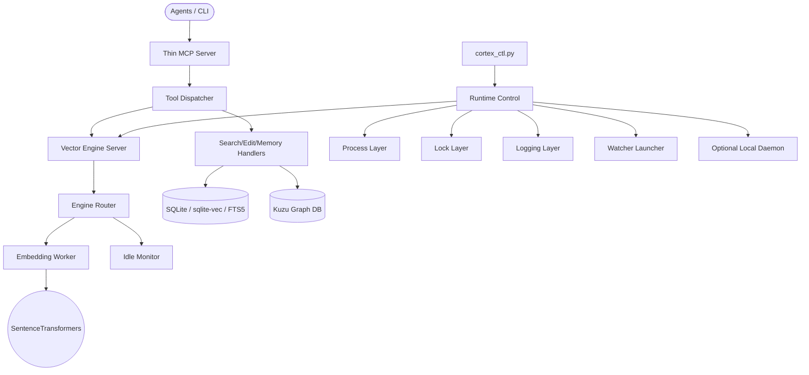

[English Version Available](README.en.md)

# Cortex Agent Infrastructure (`.cortex`)

**"The Bridge between Human Intent and Agent Intelligence."**

파편화된 에이전트의 기억을 영속화하고, MCP(Model Context Protocol)를 통해 어떤 프로젝트에서든 즉시 작업 맥락을 형성할 수 있도록 설계된 범용 에이전트 엔지니어링 인프라입니다. 최신 멀티 에이전트 오케스트레이션 패턴과 하이브리드 데이터베이스 기술을 결합하여 로컬 우선 컨텍스트 엔진을 제공합니다.

최근 구조는 `.cortex` 경로 모델을 기본으로 사용하며, 기존 단일 제어 파일 중심 구조를 dispatcher/server/runtime 계층으로 분리하는 방향으로 정리되었습니다.

---

## 시스템 아키텍처

기존 단일체 엔진은 MCP dispatcher, engine server, embedding worker, watcher, process control 계층으로 분리되었습니다. `cortex_ctl.py`는 thin entrypoint로 남고, 실제 start/status/stop 로직은 `scripts/cortex/runtime/` 하위 모듈에 위치합니다.



---

## 주요 특징

### 1. Hybrid Context Engine & AST Parsing

- **AST Structural Parsing (`Tree-sitter`)**: Python, C#, TypeScript 등의 코드를 AST 수준으로 분석하여 클래스, 함수, 호출 관계를 추출합니다.
- **Vector Search (`sqlite-vec`)**: 로컬 SQLite 기반 벡터 검색으로 외부 서버 없이 시맨틱 검색을 수행합니다.
- **Graph Analysis (`Kuzu DB`)**: 함수 호출, 포함 관계, 외부 참조를 그래프 형태로 추적합니다.
- **FTS5 Text Search**: 키워드 기반 검색과 RRF(Reciprocal Rank Fusion) 결합을 지원합니다.

### 2. Runtime Modularization

런타임 제어 계층은 다음처럼 분리되어 있습니다.

- `runtime/paths.py`: 포트, 스크립트, 로그/락 파일 경로
- `runtime/ipc.py`: 길이 prefix 기반 소켓 메시지 송수신
- `runtime/environment.py`: child process 환경 변수 구성
- `runtime/process.py`: 백그라운드 프로세스 실행 및 PID 관리
- `runtime/lock.py`: ctl 실행 단위 상호 배제
- `runtime/logging.py`: 런타임 로그 설정
- `runtime/control.py`: start/status/stop orchestration
- `runtime/engine_server.py`: engine server entrypoint
- `runtime/engine_router.py`: worker 라우팅 및 idle 모니터 연계
- `runtime/engine_worker.py`: PyTorch/SentenceTransformers embedding worker
- `runtime/worker_manager.py`: worker 기동/종료/상태 확인
- `runtime/watcher_launcher.py`: watchdog watcher 실행
- `runtime/local_daemon.py`: 선택적 local daemon 실행

이 구조는 Python 구현을 유지하면서도 추후 CLI hook 연동, Rust 등 일부 구성요소 포팅, worker 교체를 쉽게 하기 위한 경계입니다.

### 3. `.cortex` Path Model

신규 기준 경로는 `.cortex`입니다. `.agents`는 레거시 호환 경로로 남아 있으나, 설치/문서/CI는 `.cortex` 기준으로 정리됩니다.

- `CORTEX_HOME`: Cortex 인프라 루트
- `CORTEX_WORKSPACE`: 실제 작업 대상 프로젝트 루트
- `CORTEX_ENV_PATH`: `.env` 파일 위치를 직접 지정할 때 사용

### 4. Multi-Lane Parallel Execution

도메인(Lane) 기반 병렬 락 시스템을 통해 여러 터미널 또는 에이전트가 동시에 작업할 때 충돌을 줄입니다. 릴레이 계층은 작업 핸드오프와 동시성 제어를 담당합니다.

### 5. Hardware-Aware Embedding Strategy

SentenceTransformers/PyTorch 기반 embedding worker를 별도 프로세스로 격리합니다. GPU/MPS/CUDA 사용은 Python worker에 남겨 두고, control/server/router 계층은 모델 의존성을 낮춘 구조로 유지합니다.

---

## 디렉토리 구조

```text
.cortex/
├── data/           # [비공유] 상태 및 하이브리드 DB
├── docs/           # [비공유] 인프라 관련 문서
├── history/        # [비공유] 세션별 작업 이력 및 로그
├── hooks/          # 런타임 라이프사이클 훅
├── rules/          # 에이전트 행동 규칙 및 정밀 편집 지침
├── scripts/        # Cortex 코어 모듈, MCP 서버, runtime 제어 계층
├── skills/         # [비공유] 에이전트 전용 스킬 가이드
├── tasks/          # 능동적 추적을 위한 작업 문서
├── templates/      # 시스템 템플릿 및 ignore 번들
├── knowledge/      # 외부 지식 라이브러리
├── pyproject.toml  # uv 기반 의존성 선언
├── .venv/          # [비공유] uv 가상 환경
├── uv.lock         # 패키지 잠금 파일
├── .env            # [비공유] 환경 변수
└── settings.yaml   # 인프라 전역 설정
```

---

## Cortex Modular Layout

최근 구조 개편에 따라 Cortex 백엔드는 역할별 패키지로 분리되었습니다. 기존 `cortex/db.py`, `cortex/search_engine.py` 등은 외부 호환성을 위한 얇은 래퍼(Thin wrapper)로만 존재합니다. 실제 구현은 하위 패키지에 위치합니다:

- `cortex/indexing/`: 인덱싱 파이프라인 (추출, 기록, 그래프 동기화)
- `cortex/embeddings/`: 모델 로드, 배치 임베딩, 하드웨어 자동 감지
- `cortex/retrieval/`: 하이브리드 검색 알고리즘 (FTS, 벡터, RRF 병합)
- `cortex/storage/`: SQLite 및 GraphDB 스키마/연결 관리
- `cortex/memories/`: 관찰 기록(단기) 및 영구 지식(Persistent) CRUD
- `cortex/config/`: YAML 설정 로드 및 하드웨어 기반 튜닝
- `cortex/scanner/`: `.gitignore` 기반 스캐닝 필터
- `cortex/parsers/`: Tree-sitter 중심 파서 레지스트리
- `cortex/runtime/`: 데몬 워커, 락 관리, IPC 등 실행 환경 인프라

> 외부 Workspace 경로 대응은 `runtime.paths` 및 신규 `.cortex` 경로 정책을 따르며, 모델 다운로드나 GPU 토큰 의존성 검증은 기본 CI에서 제외되고 로컬 구성 이후의 별도 검증 대상으로 분류됩니다.

---

## 설치 및 사용

상세 가이드는 [INSTALL.md](./INSTALL.md)를 참고하십시오.

핵심 커맨드:

```bash
uv sync --project .cortex
uv run --project .cortex python .cortex/scripts/cortex/indexer.py . --force
uv run --project .cortex python .cortex/scripts/cortex_ctl.py status
uv run --project .cortex python .cortex/scripts/cortex_ctl.py start
uv run --project .cortex python .cortex/scripts/cortex_ctl.py stop
```

MCP 등록 시에는 `PYTHONPATH`, `CORTEX_HOME`, `CORTEX_WORKSPACE`를 명시하는 것을 권장합니다.

---

## CI 검증 범위

GitHub Actions는 Windows와 Ubuntu에서 다음을 검증합니다.

- `uv sync` 기반 의존성 설치
- `scripts/**/*.py` 전체 `py_compile`
- runtime 모듈 import smoke
- `scripts/cortex/tests/test_*.py` 회귀 테스트
- `.cortex` 기준 테스트 워크스페이스 인덱싱
- MCP JSON-RPC smoke test

장시간 daemon 실기동, 실제 GPU/CUDA 메모리 동작, 로컬 모델 캐시 상태는 환경 의존성이 높아 로컬 검증 대상으로 둡니다.

---

## 영감 및 참고

- **Vexp**: 범용 워크플로 프레임워크 구조와 DB 스키마 형식 참고
- **oh-my-agent**: 역할 기반 에이전트 전문화 및 포터블 에이전트 정의 개념
- **oh-my-claudecode**: 심층 인터뷰와 아티팩트 기반 핸드오프 패턴
- **oh-my-openagent**: 해시 기반 정밀 편집과 검증 루프 패턴

---

## 라이선스

- **Code**: [MIT License](LICENSE)
- **Knowledge**: 외부 지식 라이브러리의 원본은 [antigravity-awesome-skills](https://github.com/sickn33/antigravity-awesome-skills)이며 [CC BY 4.0](https://creativecommons.org/licenses/by/4.0/) 라이선스를 따릅니다.
