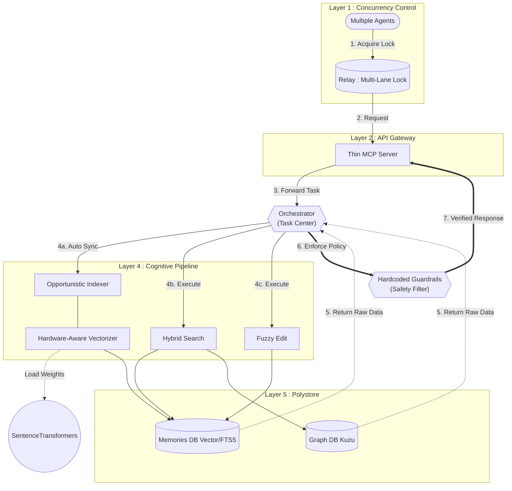

# 🌌 Cortex Agent Infrastructure (`.agents`)

**"The Bridge between Human Intent and Agent Intelligence."**

파편화된 에이전트의 기억을 영속화하고, MCP(Model Context Protocol)를 통해 어떤 프로젝트에서든 즉시 작업 맥락(Context)을 형성할 수 있도록 설계된 **범용 에이전트 엔지니어링 인프라**입니다. 본 프로젝트는 최신 멀티 에이전트 오케스트레이션 패턴과 하이브리드 데이터베이스 기술을 결합하여 강력한 컨텍스트 엔진을 제공합니다.

최근 **v2.1.0 릴리즈**부터는 "Inference Economy" 철학을 바탕으로, 백그라운드 오버헤드가 제로에 가까운 **하드웨어 인지형 하이브리드 엔진**으로 거듭났습니다.

---

## 🏗 시스템 아키텍처 (Architecture)

단일체(Monolith)였던 기존 V1 엔진을 기능별 전문 모듈로 완전히 분리하여 확장성과 안정성을 극대화했습니다.




---

## 🚀 주요 이념 및 특징 (Key Features)

### 1. Hybrid Context Engine (Vector + Graph + RDB)
*   **Vector Search (`sqlite-vec`)**: 무거운 FAISS 등 외부 종속성 없이 로컬 환경에 100% 네이티브로 구동되어 시맨틱 검색을 수초 내에 복원합니다.
*   **Graph Analysis (`Kuzu DB`)**: Cypher 쿼리를 통해 모듈 간 함수 호출(Calls), 포함 관계(Contains), 외부 라이브러리 참조(External)를 추적하여 입체적인 컨텍스트를 제공합니다.
*   **FTS5 Text Search**: 키워드 기반 고속 텍스트 검색과 RRF(Reciprocal Rank Fusion) 스코어링을 지원합니다.

### 2. 추론 경제 & 하드웨어 인지 전략 (Inference Economy)
*   **GPU_THRESHOLD 휴리스틱**: VRAM을 아끼기 위해 20건 이내의 소규모 데이터는 강제로 CPU 처리하며, 작업 완료 시 즉각 `release_gpu()`를 호출해 VRAM을 반환합니다.
*   **지능형 성능 스로틀링 (`settings.yaml`)**: 엔진이 구동 순간 현재 PC 사양을 감지하여 기기 다운을 막기 위해 캐시 정리 주기와 배치 사이즈를 자가 제어(Dynamic Downscaling)합니다.
*   **기회적 인덱싱 (Opportunistic Indexing)**: 에이전트가 MCP를 호출하는 순간 프로젝트 전체의 `mtime`을 스캔하여 변경분만 추적하는 제로 오버헤드 동기화 훅(Hook)을 사용합니다.

### 3. Multi-Lane Parallel Execution
단일 전역 Lock의 한계를 넘어, **도메인(Lane) 기반의 병렬 락 시스템**을 지원합니다. 여러 터미널에서 동시에 작업하더라도 각자 할당된 레인(예: `frontend`, `backend`)에서 충돌 없이 안전하게 핸드오프가 가능합니다. (`fcntl` 배타적 락 기반)

### 4. Precision Editing (Hashline Style)
줄 번호 어긋남으로 인한 코드 훼손을 방지하기 위해 내용 기반 치환을 사용합니다. 이제 편집 엔진에 소형 LLM(0.6B) 특유의 들여쓰기 공백 실수까지 잡아내는 퍼지 매칭 로직이 탑재되어 더욱 안전해졌습니다.

### 5. Lean Context Optimization & Guardrails
`.geminiignore` 등을 통해 에이전트의 오염된 파일 스캔은 차단하고, 쉘 명령(`grep`, `find` 등)을 직접 입력하는 것을 엄격히 금지합니다. 모든 탐색과 편집은 통제된 **캡슐 검색(Capsule Search)**과 MCP 파이프라인을 거치도록 강제하여 토큰 효율과 작업 안정성을 극대화합니다.

---

## 📂 디렉토리 구조 (Directory Structure)

```
.agents/
├── data/           # [비공유] 상태 및 하이브리드 DB (Kuzu, sqlite-vec)
├── docs/           # [비공유] 인프라 관련 문서 (구조만 공유)
├── history/        # [비공유] 세션별 작업 이력 및 관찰 기록
├── hooks/          # 런타임 라이프사이클 훅 (hooks_manager 디스패처)
├── rules/          # 에이전트 행동 규칙 및 정밀 편집 지침
├── scripts/        # Cortex 코어 모듈, MCP 서버 및 릴레이 관리 스크립트
├── skills/         # [비공유] 에이전트 전용 스킬 가이드
├── tasks/          # 능동적 추적을 위한 작업 문서 (Todo Manager)
├── templates/      # 시스템 템플릿 파일 및 ignore 번들
├── knowledge/      # 외부 지식 라이브러리
├── venv/           # [비공유] 파이썬 가상 환경
├── .env            # [비공유] 환경 변수
└── settings.yaml   # 인프라 전역 설정 및 튜닝 파라미터
```

---

## 🛠 설치 및 사용 (Installation)

- **상세 가이드**: [INSTALL.md](./INSTALL.md)
- **핵심 커맨드**:
  - `/로드`: Google Drive에서 `.agents` 폴더를 워크스페이스로 가져오기
  - `/백업`: 현재 `.agents` 로컬 상태를 Google Drive에 백업 (`rclone` 기반)
  - `/지식화`: 주요 결정 사항 및 성공 패턴 영구 저장
  - `python3 .agents/scripts/relay.py status`: 현재 릴레이(멀티 에이전트 락) 상태 확인

---

## 🙌 영감 및 참고 (Inspirations)

Cortex는 다음의 훌륭한 프로젝트들의 개념을 파이썬 기반으로 경량화하고 통합하여 탄생했습니다.

- **Vexp ([https://vexp.dev/](https://vexp.dev/))**: 
  - 범용 워크플로 프레임워크의 구조와 DB 스키마 형식을 참고하여 로컬 컨텍스트 엔진으로 재구현하였습니다.
- **oh-my-agent ([first-fluke/oh-my-agent](https://github.com/first-fluke/oh-my-agent))**: 
  - 역할 기반의 에이전트 전문화 및 포터블한 에이전트 정의 개념을 도입했습니다.
- **oh-my-claudecode ([Yeachan-Heo/oh-my-claudecode](https://github.com/Yeachan-Heo/oh-my-claudecode))**: 
  - 소크라테스식 심층 인터뷰(Deep Interview)와 아티팩트 기반 핸드오프 패턴을 흡수했습니다.
- **oh-my-openagent ([code-yeongyu/oh-my-openagent](https://github.com/code-yeongyu/oh-my-openagent))**: 
  - 해시 기반 정밀 편집(Hashline)과 무한 검증 루프(Sisyphus-style)를 통한 작업 완료 보장 메커니즘을 이식했습니다.

---

## ⚖️ 라이선스 (License)
- **Code**: [MIT License](LICENSE)
- **Knowledge**: 외부 지식 라이브러리의 원본은 [antigravity-awesome-skills](https://github.com/sickn33/antigravity-awesome-skills)이며 [CC BY 4.0](https://creativecommons.org/licenses/by/4.0/) 라이선스를 따릅니다.
